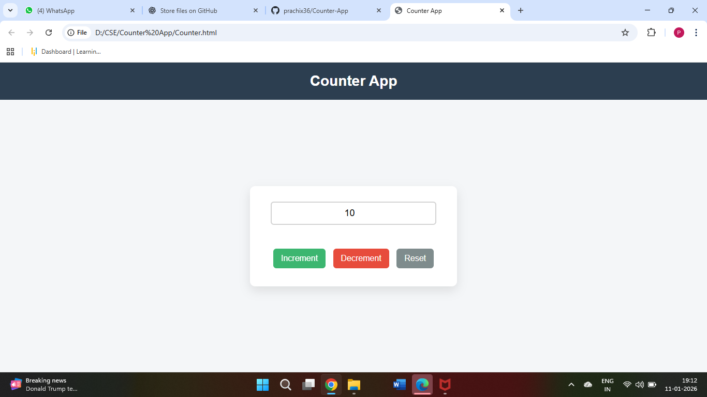

# Counter App

A simple web-based counter application built using HTML, CSS, and JavaScript.  
It allows users to increment, decrement, and reset a number with a clean user interface.

## 🚀 Features
- Increment the counter
- Decrement the counter
- Reset the counter to zero
- Input validation with error message
- Responsive UI

## 🛠️ Technologies Used
- HTML5
- CSS3
- JavaScript (DOM Manipulation)

## 📂 Project Structure
Counter.html
counter.css
counter.js

## 📸 Preview

## ▶️ How to Run
1. Download or clone the repository
2. Open `index.html` in any browser
3. Use the buttons to interact with the counter

## 💡 Learning Outcome
- DOM manipulation
- Event handling in JavaScript
- Form validation
- Basic UI styling

## 👩‍💻 Author
Prachi Singh
